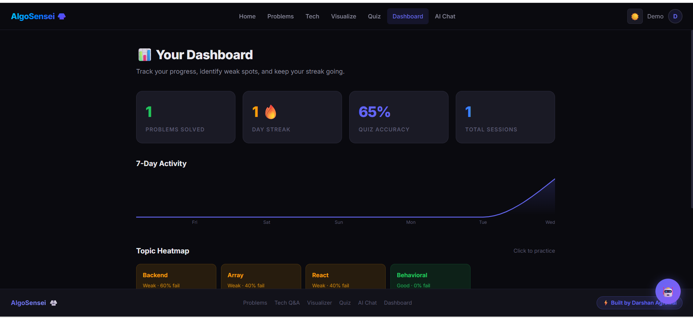
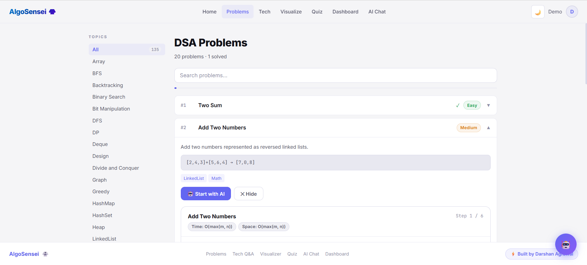
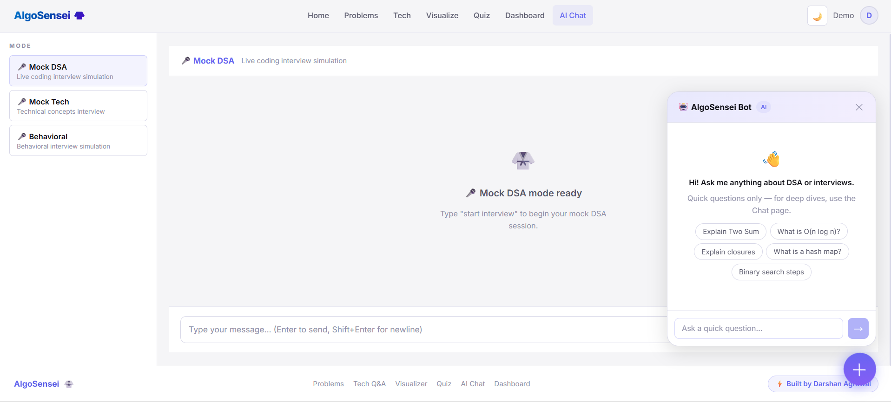
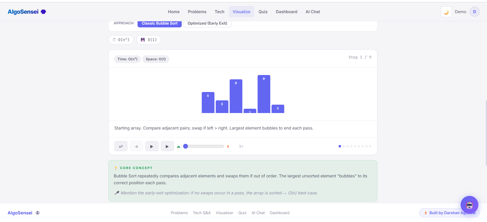
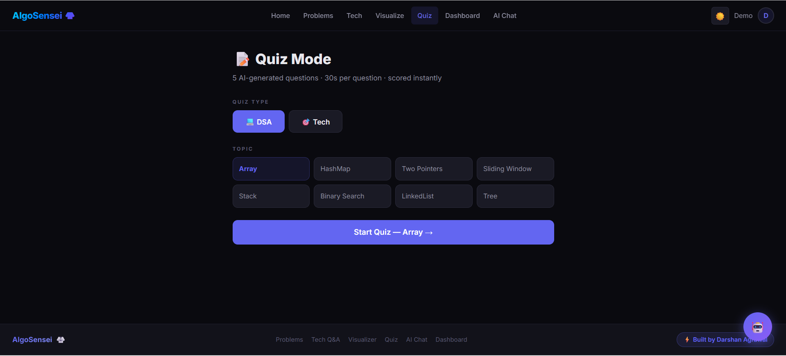

# AlgoSensei 🥋

> **AI-powered DSA & technical interview preparation platform.**  
> Practice smarter, not harder — with Socratic hints, mock interviews, algorithm visualizations, and personalized weak-topic tracking.

[](https://algosensei-ochre.vercel.app)
[](https://react.dev)
[](https://expressjs.com)
[](https://www.mongodb.com/atlas)
[](https://groq.com)

---

## 📸 Screenshots

> **Dashboard — Streak, accuracy & heatmap analytics**



> **DSA Problems — Filter, track progress, get AI hints**



> **AI Chat — 6 modes including Socratic, mock interview & solution reveal**



> **Algorithm Visualizer — Bar chart & tree modes**



> **Quiz Engine — Timed quizzes with weak topic detection**



---

## ✨ Features

**DSA Practice**
- 100+ curated problems with difficulty tagging, category filters, and per-user progress tracking
- Bookmark problems and resume where you left off

**Technical Interview Prep**
- 120+ interview questions spanning 7 categories: JavaScript, React, Node.js, System Design, CS Fundamentals, Behavioral, and more
- Filterable by category, subcategory, and difficulty

**AI-Powered Chat (6 Modes)**
- **Socratic Hints** — guides you to the answer without spoiling it
- **Solution Reveal** — full walkthrough with explanation
- **Mock Interview** — simulates a real technical interview round
- **Complexity Analysis** — breaks down time and space complexity
- **Code Review** — reviews your solution for improvements
- **Concept Explainer** — deep-dives into any DSA concept
- Streaming responses powered by Groq (LLaMA 3.3 70B)

**Algorithm Visualizer**
- 14 pre-built algorithm animations (sorting, trees, graphs, and more)
- Toggle between bar chart and tree visualization modes
- AI animation generator — describe *any* algorithm and get a custom visualization

**Quiz Engine**
- Timed quizzes with configurable difficulty and topic
- Automatic weak topic detection and tracking across sessions

**Dashboard & Analytics**
- Daily streak tracker
- Accuracy trends over time
- GitHub-style activity heatmap

**Auth**
- Google OAuth 2.0 via Passport.js
- JWT-based session management

---

## 🛠 Tech Stack

| Layer | Technology |
|---|---|
| Frontend | React 19, Vite, React Router DOM v7 |
| Backend | Express 5, Node.js |
| Database | MongoDB Atlas, Mongoose 9 |
| Auth | Passport.js, Google OAuth 2.0, JWT |
| AI | Groq API — `llama-3.3-70b-versatile` |
| Deployment | Vercel (client), Render / Railway (server) |

---

## 🚀 Getting Started

### Prerequisites
- Node.js 18+
- MongoDB Atlas URI
- Groq API key
- Google OAuth credentials

### 1. Clone the repo

```bash
git clone https://github.com/darshan12-code/algosensei.git
cd algosensei
```

### 2. Set up environment variables

**`server/.env`**
```env
MONGODB_URI=your_mongodb_atlas_uri
GROQ_API_KEY=your_groq_api_key
GOOGLE_CLIENT_ID=your_google_client_id
GOOGLE_CLIENT_SECRET=your_google_client_secret
JWT_SECRET=your_jwt_secret
CLIENT_URL=http://localhost:5173
```

**`client/.env`**
```env
VITE_API_URL=http://localhost:5000
```

### 3. Start the server

```bash
cd server
npm install
node scripts/seedDSA.js    # Seed DSA problems
node scripts/seedTech.js   # Seed tech interview questions
npm run dev
```

### 4. Start the client

```bash
cd client
npm install
npm run dev
```

App runs at `http://localhost:5173`.

---

## 📁 Project Structure

```
algosensei/
├── client/                  # React + Vite frontend
│   ├── src/
│   │   ├── components/      # Reusable UI components
│   │   ├── pages/           # Route-level page components
│   │   ├── context/         # Auth context
│   │   ├── hooks/           # Custom hooks (useStream, useDebounce)
│   │   └── lib/             # API client, animations, theme
│   └── vite.config.js
│
└── server/                  # Express backend
    ├── routes/              # API route handlers
    ├── models/              # Mongoose schemas
    ├── lib/                 # Groq client, prompts, rate limiter
    ├── middleware/          # Auth middleware
    └── scripts/             # DB seed scripts
```

---

## 🤝 Contributing

Pull requests are welcome! For major changes, please open an issue first to discuss what you'd like to change.

---

## 📄 License

[MIT](./LICENSE)

---

<p align="center">Built with ☕ and way too many LeetCode problems.</p>
